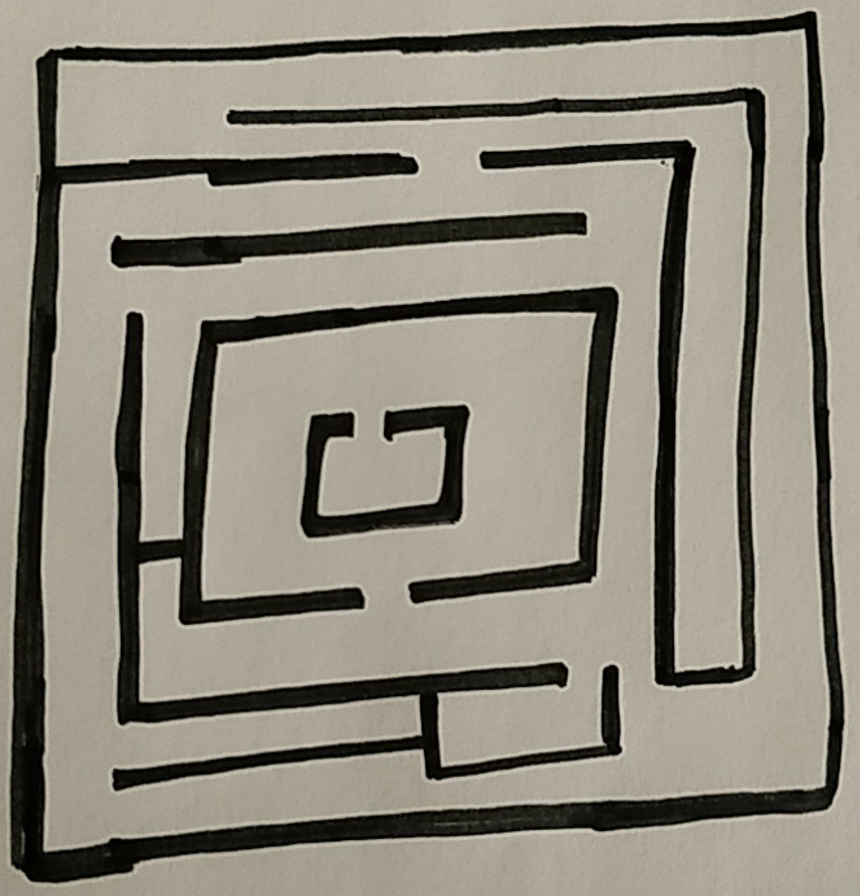

# Crispy-IndoorNav
This project aims to aid the user to help navigate indoors via the shortest possible pathway without any positioning service or network needs.
It is developed in python using A-Star path finding rule and opencv.

It is supported by a telegram bot service so that it can be accessed by anyone, anytime and anywhere.

[](https://www.python.org/)

[](https://www.python.org/downloads/release/python-350/)  
[](https://pypi.org/project/opencv-python/)
[](https://pypi.org/project/python-telegram-bot/)
[](https://pypi.org/project/python-telegram-bot/)


### Cloning
Use the link below to close this repository to your machine.
```
https://github.com/Severus11/crispy-IndoorNav.git
```
### Pre-requisites 
These are the required dependencies needed to setup the environment
```
$ pip3 install -r requirements.txt
```
### How to use:
- Open Telegram and use botFather to create a personalized bot and generate a key
- Add the key in bot.py and run it.
- Open the newly created bot and send the image of the naviagation area.
- An image with the shortest path to traverse the area will be returned.
- Simulataneously final_npGrid.py can be ran to solve the grid manually.


### User Customization:
- Edit the map: Simply send the photo of the map of the navigation site or a maze to the telegram bot.
- Edit the output map style, representation of path and color for ease of usage.

### Sample Output:
- Input Image


- Output Image with shortest path mapped


- Telegram


### Author
 [](https://www.linkedin.com/in/parthsarthi-gupta-265b9816a)

- Parthsarthi Gupta
